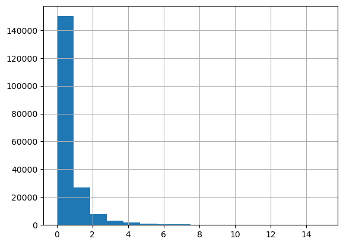
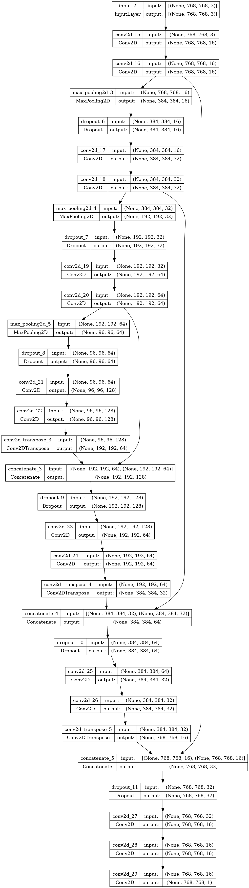
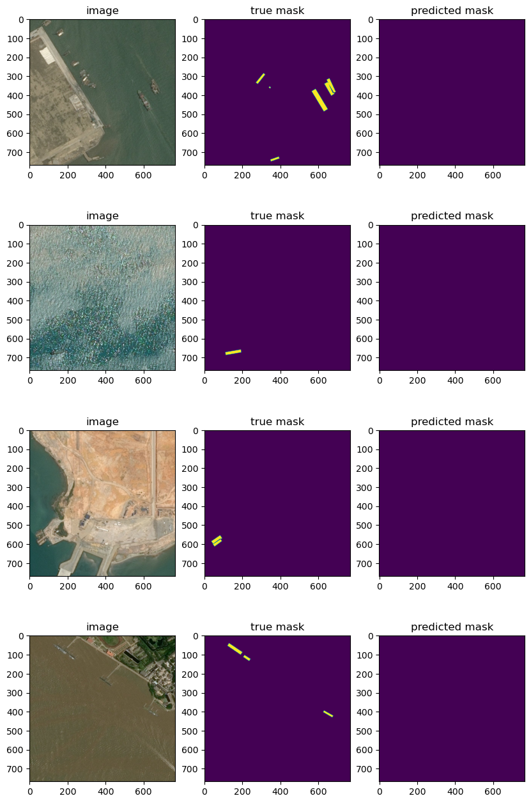

# AirbusChallenge

It's my take on the Kaggle competition - [Airbus Ship Detection Challenge](https://www.kaggle.com/competitions/airbus-ship-detection). However, this repository was created for performing the test assignment, so there are some requirements and limitations for the solution:

* The model should have UNET-like architecture.
* The model should be implemented via tensorflow framework.
* The loss function used for the solution should be [Dice loss](https://paperswithcode.com/method/dice-loss).

## Short repository information

Basically, the repository has the following structure (here listed only crucial parts for use - code and data organization):
```
├───data
│   ├───test_v2
│       ├───...
│   ├───train_v2
│       ├───...
│   ├───train_ship_segmentations_v2.csv
│   └───sample_submission_v2.csv
├───utils
│   ├───dataset_utils.py
│   ├───local_utils.py
│   └───model_utils.py
├───weights
│   ├───...
├───config.yaml
├───create_submission_file.py
├───exploratory_analysis.ipynb
├───train.py
└───visualize_results.ipynb
```

It's important to mention that this structure is used as default behaviour. However, structure could be changed, but be sure to update paths in .ipynb notebooks and config file.

## EDA

The first step was to perform the Exploratory Data Analysis. At this stage, the data was analysed and some distributions were built. 

So, below you can find the example of images and their corresponding masks:


However, while exploring, a great imbalance in the dataset was found - mostly dataset contains blank images (images without any ships):



So, it was decided to take for training and validation dataset with equal data distribution. For this matter 90% of empty images were removed from train/val samples:


## Model architecture and training

The next phase was to create the model and train it. The requirements  were to build a UNET-like model utilizing tensorflow framework and stick to the Dice score. 

Also, the computational resources were limited  for this task (as dataset was quite big, the loss function was custom written, and also default UNET model contains too many parameters). Due to this fact, it was decided to use a lighter version of UNET with approximately 0.5M params:



However, even for this model with batch_size=8 and 500 steps per epoch, time per epoch took approximately 30 mins. Unfortunately, the proper training was not achieved (as I did not manage to source a server for this task). So, graph below demonstrates only that code in this repository is functioning rather than the amazing results:


Due to the size of the training data and number of epochs, it's too early to deny the effectiveness of the presented approach, but additional testing is required.

## Results analysis

The predicted masks are presented below:



As we can see the trained model is not segmenting anything. This is most likely due to the fact that the model was hardly trained (a dozen epochs were run on a small batch from the general dataset).

## Futher steps

To continue the development of this approach the next steps should be implemented:
* train current version of the model with custom loss on proper data.
* use the default version of the UNET for training and compare results.
* use another type of losses that might be suitable for this task (CategoricalCrossentropy)
